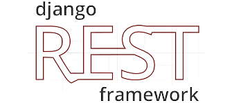
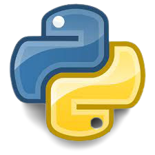
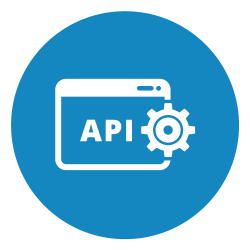
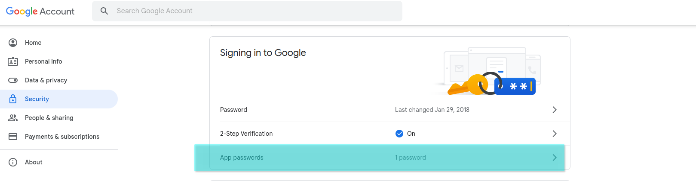
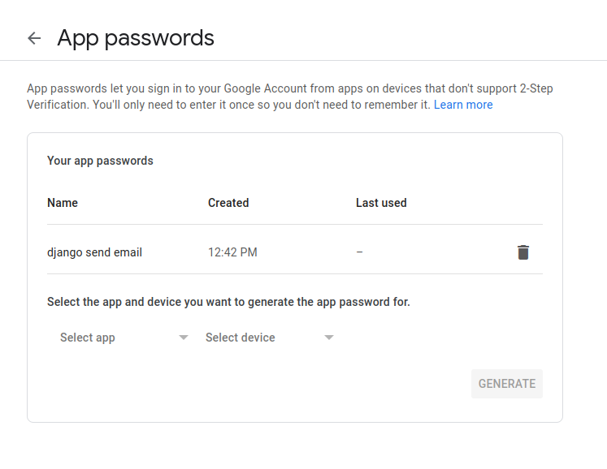
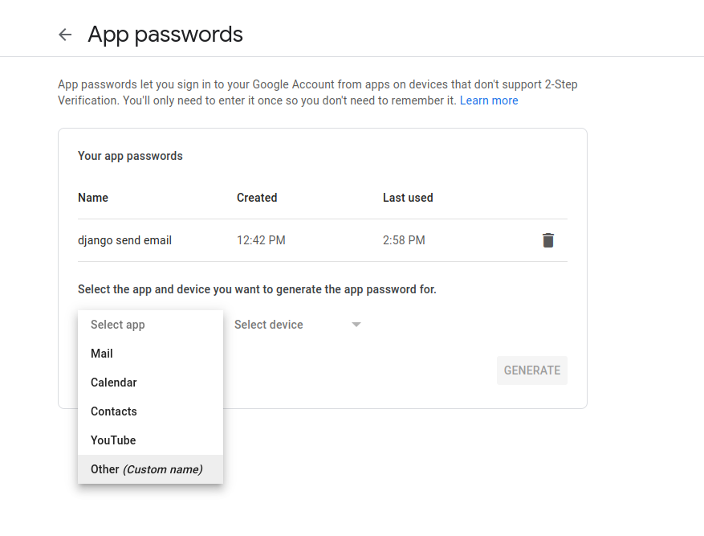
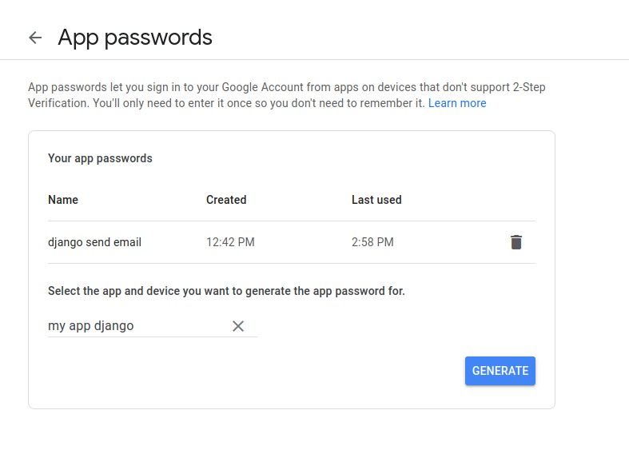
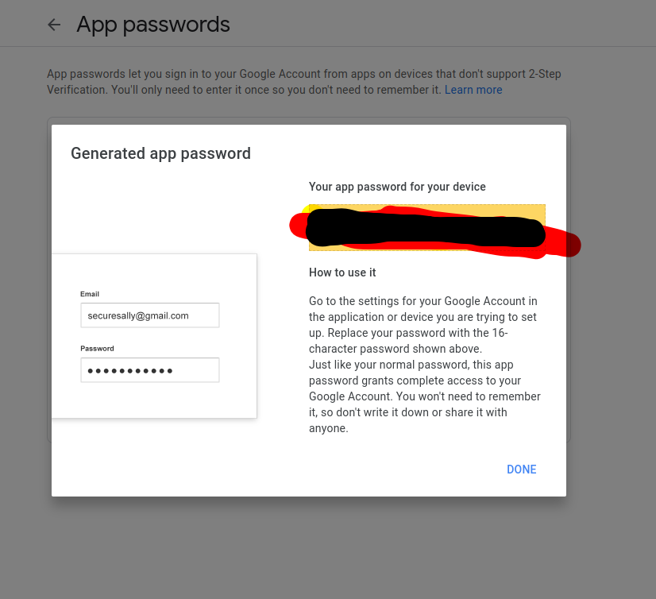

# User API Authentication & authorization :rocket: 
<p align="center">
  Building API using Django REST framework
  <br />
  <br />
  <code></code>
  <br />
  <br />
</p>

<p align="center">
  <code></code>
  <code></code>
  <code></code>
  <code></code>
  <code></code>

</p>

</p>

------
------
## How to sending email :egypt:

<p align="center"> [1] Create app with password on your gmail </p>
<p align="center">
  <code></code>
  <code></code>
  <code></code>
  <code></code>
  <code></code>
</p>

<p align="center"> [2] In settings.py add : </p>

```python
EMAIL_BACKEND = 'django.core.mail.backends.smtp.EmailBackend'
EMAIL_USE_TLS = True
EMAIL_HOST = 'smtp.gmail.com'
EMAIL_PORT = 587
EMAIL_HOST_USER = 'your gmail account'
EMAIL_HOST_PASSWORD = 'your app password'
```
<p align="center"> [2] Create model.py : </p>

```python
from django.db import models
from datetime import datetime

from django.contrib.auth.models import User 


# For email verification 
class EmailVerificationModel(models.Model):
    otp = models.IntegerField(null =True ,blank = True)
    created_at = models.DateTimeField(default =datetime.now())
    user = models.OneToOneField(User , on_delete=models.CASCADE)
```

<p align="center"> [2] create email.py </p>
<p align="center"> [2] create email.py </p>


## How to configure your Django application with environment variables :telescope:

 - Install django-environ 
  ```
  $ python -m pip install django-environ
  ```
 - python code in **project/settings.py**

```python 

import environ
import os

env = environ.Env(
    # set casting, default value
    DEBUG=(bool, False)
)

# Take environment variables from .env file
environ.Env.read_env(os.path.join(BASE_DIR, '.env'))

# False if not in os.environ
DEBUG = env('DEBUG')

# Raises Django's ImproperlyConfigured exception if SECRET_KEY not in os.environ
SECRET_KEY = env('SECRET_KEY')
```
 - base directory in django project/settings.py
```python 
BASE_DIR = './python_back_end/django_rest_frame_work_auth_model/'
```
 - As a result, the (.env) file should be located in the django_rest_framework_auth_model directory. 
 - your (.env) file , Do not leave a space between the equals sign and value. 

```
SECRET_KEY=your_secret_key
DEBUG=True
EMAIL_HOST_USER=your_gmail
EMAIL_HOST_PASSWORD=password_app
 ```

## How to create SuoerUser :telescope: 
```
$ python3 manage.py createsuperuser --username admin --email admin@gmail.com
```
## Super User Data :telescope: 
```
superuser = admin
password = admin123
```


