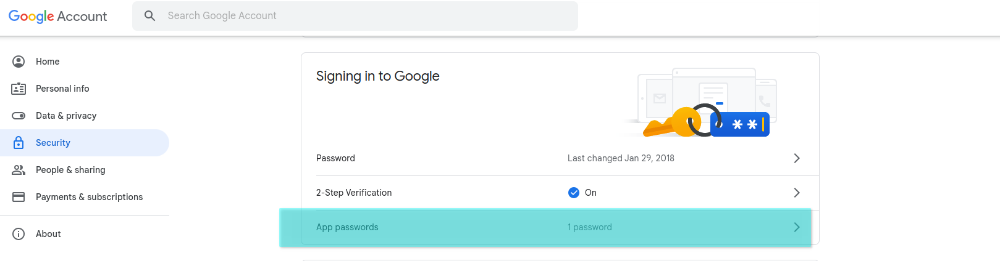
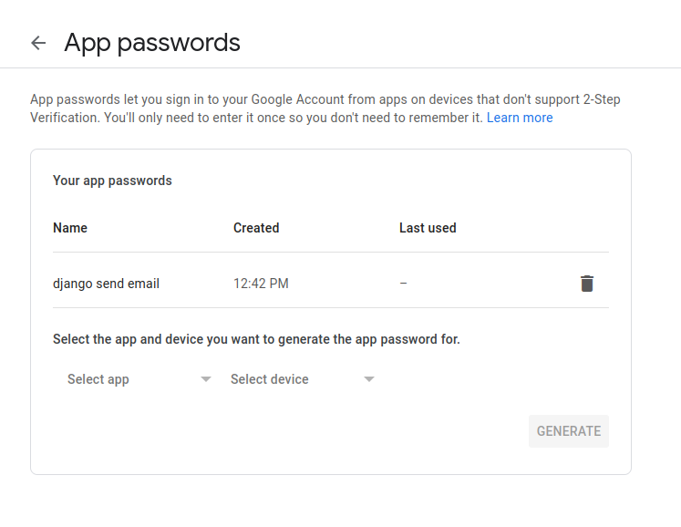
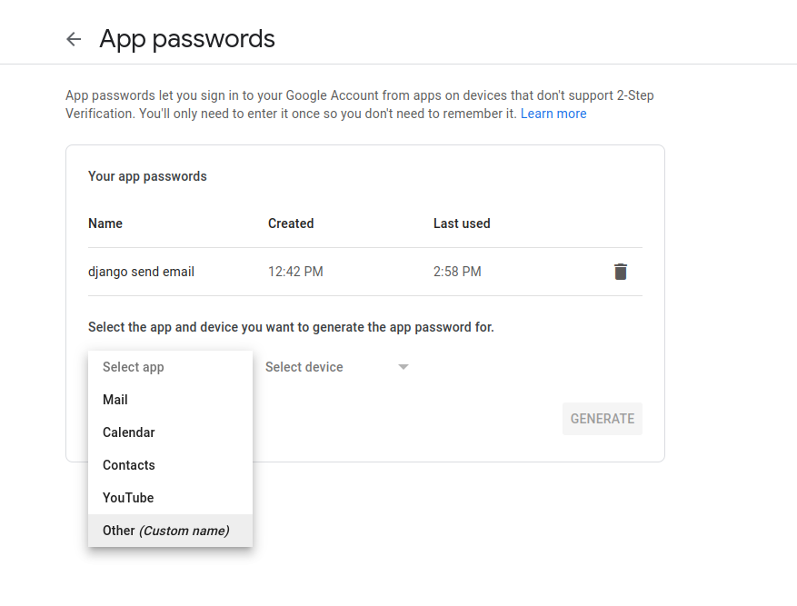
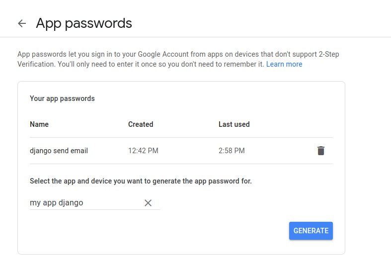
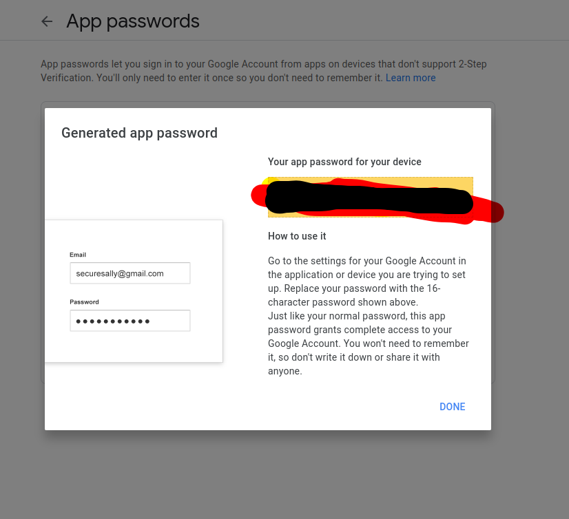

# Authentication API :rocket: 
<p align="center">
  Building API using Django REST framework
  <br />
  <br />
  <code></code>
  <br />
  <br />
</p>

<p align="center">
  <code></code>
  <code></code>
  <code></code>
  <code></code>
  <code></code>

</p>

</p>

------
------
## How to sending email :egypt:

<p align="center"> [1] Create app with password on your gmail </p>
<p align="center">
  <code></code>
  <code></code>
  <code></code>
  <code></code>
  <code></code>
</p>

<p align="center"> [2] In settings.py add : </p>

```python
EMAIL_BACKEND = 'django.core.mail.backends.smtp.EmailBackend'
EMAIL_USE_TLS = True
EMAIL_HOST = 'smtp.gmail.com'
EMAIL_PORT = 587
EMAIL_HOST_USER = 'your gmail account'
EMAIL_HOST_PASSWORD = 'your app password'
```
<p align="center"> [2] Create model.py : </p>

```python
from django.db import models
from datetime import datetime

from django.contrib.auth.models import User 


# For email verification 
class EmailVerificationModel(models.Model):
    otp = models.IntegerField(null =True ,blank = True)
    created_at = models.DateTimeField(default =datetime.now())
    user = models.OneToOneField(User , on_delete=models.CASCADE)
```

<p align="center"> [2] create email.py </p>
<p align="center"> [2] create email.py </p>


``` 
python3 manage.py createsuperuser --username admin --email admin@gmail.com
superuser = admin
password = admin123
```

